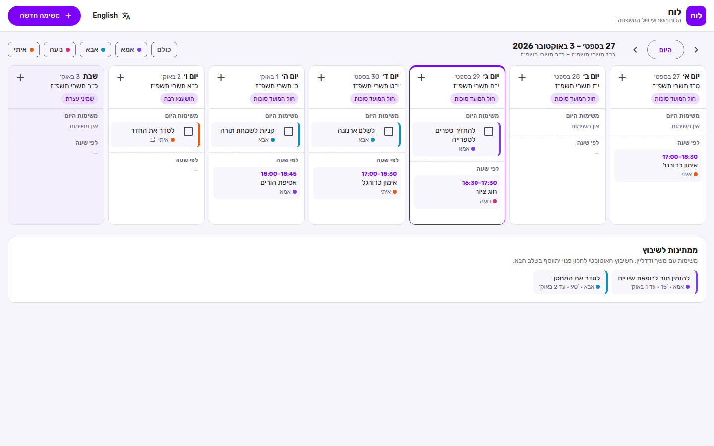
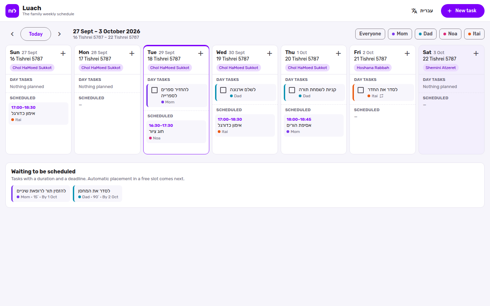
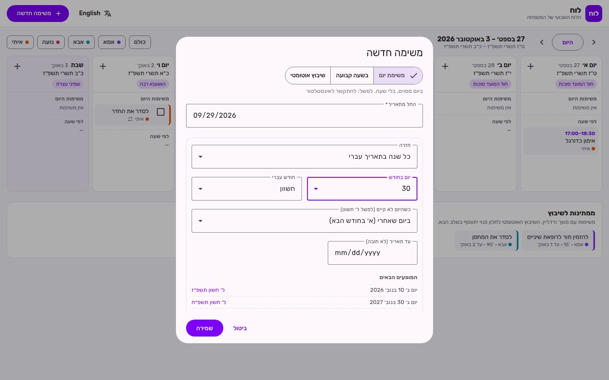
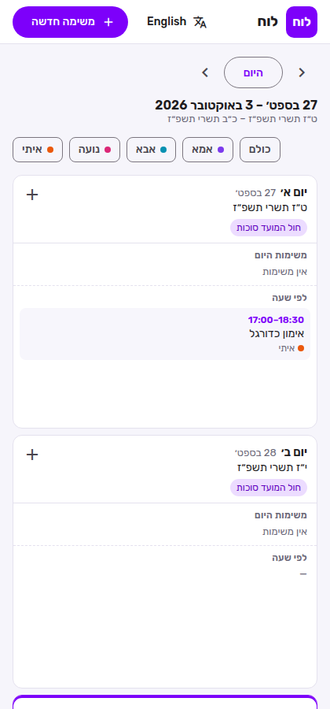
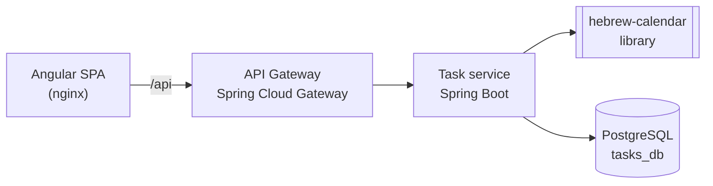

# Luach · לוח

**A smart family task system with a weekly schedule in Hebrew and Gregorian dates.**
Tasks can repeat by the Hebrew calendar (birthdays, yahrzeits, Rosh Chodesh), each family member has their own tasks, and the whole family shares one weekly view, in Hebrew or English.

Built as **Java 21 / Spring Boot microservices** behind an API Gateway, with an **Angular** frontend.

[](https://github.com/moriyaeldar/luach/actions/workflows/ci.yml)

<p>
  
</p>

| English | New task with Hebrew-date recurrence | Mobile |
|---|---|---|
|  |  |  |

## Why it's interesting

Most calendars can't answer "every year on 30 Cheshvan": Cheshvan has 30 days only in some years. Adar splits in two in a leap year. Luach has a **pure-Java recurrence engine** for the Hebrew calendar that handles these cases explicitly and lets each family choose its own custom:

| Case | What happens | Luach's rule |
|---|---|---|
| A date in Adar, in a leap year | There are two Adars | Adar II by default, or Adar I (user's choice) |
| A date in Adar I / II, in a regular year | Only one Adar exists | Falls back to Adar |
| 30 Cheshvan / 30 Kislev | Only 29 days in some years | Next day, last day of the month, or skip (user's choice) |
| Rosh Chodesh | One or two days | Every day of Rosh Chodesh |
| Yom Tov in Israel vs. abroad | Second day only abroad | Per household |

The task form shows a **live preview** of the next occurrences, so the user sees exactly which Gregorian dates a Hebrew rule produces before saving.

## Features (milestone 1)

- **Weekly view**: Hebrew and Gregorian date for every day, holidays, Rosh Chodesh, weekly parasha, and Shabbat / Yom Tov highlighted
- **Three kinds of tasks**:
  - **Day task**: tied to a date without a time, shown in the "day tasks" area at the top of the day, with a checkbox
  - **Fixed time**: at a set time, shown with its time range
  - **Auto-schedule**: a duration and a deadline, placed in a free slot by the scheduler (milestone 3)
- **Recurrence**: yearly or monthly by Hebrew date, every Rosh Chodesh, weekly, or monthly by Gregorian date, with an optional end date
- **Per-occurrence completion**: ticking this year's birthday doesn't tick next year's
- **Family members**: every task is assigned to one person, color-coded, with a filter per person
- **Hebrew and English**, switched at runtime, including RTL / LTR layout
- Responsive layout for mobile

## Architecture



The full design has five services (Household, Tasks, Scheduler, Calendar sync, Notifications) that talk through Kafka events. Each service owns its own database. This repository grows toward it milestone by milestone:

| Milestone | Scope | Status |
|---|---|---|
| **M1** Foundation | Monorepo, Gateway, Task service, Hebrew-calendar library, weekly view, Hebrew/English | ✅ Done |
| **M2** Family & Google | Household service, Google login (OAuth2), invites and roles, Kafka, one-way export to Google Calendar | Next |
| **M3** Smart scheduling | Scheduler service: priority score, auto-placement in free slots, reminders and a daily digest | Planned |
| **M4** Two-way sync | Calendar sync service: webhooks, incremental sync (syncToken), conflict rules, deployment | Planned |

### Design decisions

- **One PostgreSQL server, one database and user per service.** `deploy/postgres/init-databases.sh` creates them and revokes public access, so a service can't open another service's database.
- **The calendar engine is a library, not a service.** It's pure logic with no I/O, used by the Task service now and the Scheduler later. It has no Spring dependency and is tested exhaustively.
- **Localized data from the server.** Hebrew dates, holidays and parasha come back as `{ he, en }`, so switching language needs no extra request.
- **Everything the browser calls goes through the Gateway,** on one origin. Authentication will live there in M2.

## Tech stack

| Layer | Technologies |
|---|---|
| Backend | Java 21, Spring Boot 4, Spring Data JPA (Hibernate), Flyway, Bean Validation, RFC 9457 problem details, springdoc-openapi |
| Gateway | Spring Cloud Gateway (WebFlux) |
| Hebrew calendar | [KosherJava Zmanim](https://github.com/KosherJava/zmanim) |
| Frontend | Angular 22 (standalone components, Signals, `rxResource`, zoneless), Angular Material, typed reactive forms |
| Data | PostgreSQL 16 |
| Tests | JUnit, AssertJ, Testcontainers, MockMvc, WebTestClient, Vitest |
| Delivery | Docker (multi-stage builds), Docker Compose, GitHub Actions |

## Running it

**Everything with Docker** (needs Docker only):

```bash
docker compose up --build
# open http://localhost:8000
```

**For development:**

```bash
# 1. PostgreSQL with a tasks_db database and a tasks/tasks user (or: docker compose up postgres)
# 2. Backend
mvn install -DskipTests
java -jar services/task-service/target/task-service-0.1.0-SNAPSHOT.jar   # :8081
java -jar services/gateway/target/gateway-0.1.0-SNAPSHOT.jar             # :8080
# 3. Frontend (proxies /api to the gateway)
cd frontend && npm install && npm start                                    # http://localhost:4200
```

API docs (Swagger UI) are served by the Task service at `http://localhost:8081/swagger-ui.html`.

## API

| Method | Endpoint | Purpose |
|---|---|---|
| `GET` | `/api/week?start=2026-09-27` | Seven days: Hebrew-calendar info, day tasks, timed tasks, and tasks waiting to be scheduled |
| `GET` / `POST` | `/api/tasks` | List / create tasks |
| `GET` / `PUT` / `DELETE` | `/api/tasks/{id}` | Read / update / delete a task |
| `PUT` | `/api/tasks/{id}/completion` | Mark one occurrence done or not done |
| `POST` | `/api/recurrence/preview` | Next occurrences of a rule, with their Hebrew dates |
| `GET` | `/api/members` | Family members (interim, moves to the Household service in M2) |

Example: a birthday every 3 Tevet.

```json
POST /api/tasks
{
  "title": "Grandma's birthday",
  "assigneeId": "ima",
  "scheduleMode": "DAY",
  "date": "2026-01-01",
  "recurrence": { "kind": "HEBREW_YEARLY", "hebrewMonth": "TEVET", "hebrewDay": 3 }
}
```

## Tests

```bash
mvn verify                             # backend: unit + integration (Testcontainers starts PostgreSQL)
cd frontend && npx ng test --watch=false
```

- **hebrew-calendar**: known dates across leap and regular years (Rosh Hashanah, Purim in Adar / Adar II), 30 Cheshvan checked for every year from 5780 to 5800, and a randomized property test (400 rules): results are sorted, inside the range, and map back to the requested Hebrew date
- **task-service**: API integration tests against a real PostgreSQL (week assembly, recurrence, per-occurrence completion, validation errors) plus unit tests for business rules
- **gateway**: routing tests against a stub service
- **frontend**: date helpers, runtime language / direction switching, and the week view component

To run backend integration tests against an existing database instead of Docker, set `TEST_DATABASE_URL`, `TEST_DATABASE_USER` and `TEST_DATABASE_PASSWORD`.

## Project structure

```
libs/hebrew-calendar/   Recurrence engine and day info (pure Java)
services/task-service/  Tasks, recurrence rules, weekly view API
services/gateway/       API Gateway
frontend/               Angular app
deploy/                 Dockerfile for Java services, PostgreSQL init script
docker-compose.yml      The whole system, one command
```

---

Built by [Moriya Eldar](https://www.linkedin.com/in/moriya-eldar/).
