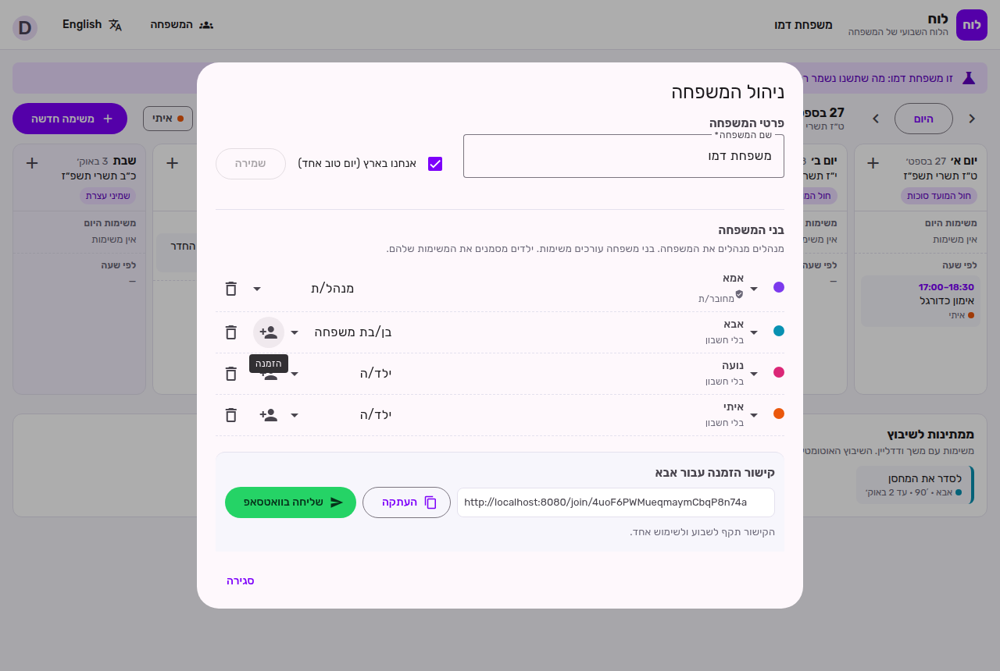
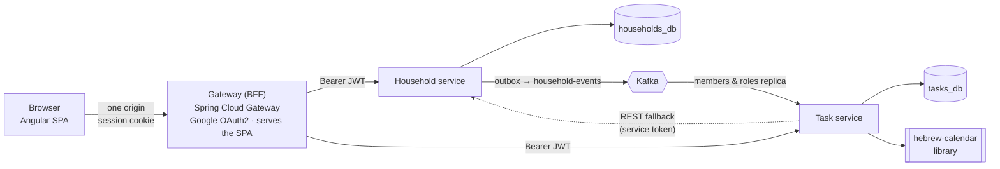

# Luach · לוח

**A smart family task system with a weekly schedule in Hebrew and Gregorian dates.**
Tasks can repeat by the Hebrew calendar (birthdays, yahrzeits, Rosh Chodesh), each family member has their own tasks, and the whole family shares one weekly view, in Hebrew or English.

Built as **Java 21 / Spring Boot microservices** that talk through **Kafka**, behind a Spring Cloud Gateway that handles **Google sign-in**, with an **Angular** frontend.

[](https://github.com/moriyaeldar/luach/actions/workflows/ci.yml)

**Live demo: [luach-moriya.onrender.com](https://luach-moriya.onrender.com)**: press "Try the demo" to get your own sample family, no sign-up (free hosting: the first load after a quiet period can take about a minute)

<p>
  
</p>

| English | New task with Hebrew-date recurrence | Family, roles and invite links | Mobile |
|---|---|---|---|
|  |  |  |  |

## Why it's interesting

Most calendars can't answer "every year on 30 Cheshvan": Cheshvan has 30 days only in some years. Adar splits in two in a leap year. Luach has a **pure-Java recurrence engine** for the Hebrew calendar that handles these cases explicitly and lets each family choose its own custom:

| Case | What happens | Luach's rule |
|---|---|---|
| A date in Adar, in a leap year | There are two Adars | Adar II by default, or Adar I (user's choice) |
| A date in Adar I / II, in a regular year | Only one Adar exists | Falls back to Adar |
| 30 Cheshvan / 30 Kislev | Only 29 days in some years | Next day, last day of the month, or skip (user's choice) |
| Rosh Chodesh | One or two days | Every day of Rosh Chodesh |
| Yom Tov in Israel vs. abroad | Second day only abroad | Per household |

The task form shows a **live preview** of the next occurrences, so the user sees exactly which Gregorian dates a Hebrew rule produces before saving.

## Features

- **Weekly view**: Hebrew and Gregorian date for every day, holidays, Rosh Chodesh, weekly parasha, and Shabbat / Yom Tov highlighted
- **Three kinds of tasks**:
  - **Day task**: tied to a date without a time, shown in the "day tasks" area at the top of the day, with a checkbox
  - **Fixed time**: at a set time, shown with its time range
  - **Auto-schedule**: a duration and a deadline, placed in a free slot by the scheduler (milestone 3)
- **Recurrence**: yearly or monthly by Hebrew date, every Rosh Chodesh, weekly, or monthly by Gregorian date, with an optional end date
- **Per-occurrence completion**: ticking this year's birthday doesn't tick next year's
- **Family members**: every task is assigned to one person, color-coded, with a filter per person
- **Sign in with Google**, or **try the demo** without an account: a private sample family with a ready week, deleted after 24 hours
- **Several families per user**, with roles: **admins** manage the family, **members** edit tasks, **children** see the schedule and tick off their own tasks. Family members don't need an account (a toddler still has tasks)
- **Invite links** for a specific family member, shared on WhatsApp or copied; single use, valid for a week
- **Hebrew and English**, switched at runtime, including RTL / LTR layout
- Responsive layout for mobile

## Architecture



The full design has five services (Household, Tasks, Scheduler, Calendar sync, Notifications) that talk through Kafka events. Each service owns its own database. This repository grows toward it milestone by milestone:

| Milestone | Scope | Status |
|---|---|---|
| **M1** Foundation | Monorepo, Gateway, Task service, Hebrew-calendar library, weekly view, Hebrew/English | ✅ Done |
| **M2a** Families | Household service, Google login (OAuth2) and demo login, invites and roles, Kafka | ✅ Done |
| **M2b** Google Calendar | One-way export of tasks to Google Calendar | Next |
| **M3** Smart scheduling | Scheduler service: priority score, auto-placement in free slots, reminders and a daily digest | Planned |
| **M4** Two-way sync | Calendar sync service: webhooks, incremental sync (syncToken), conflict rules, deployment | Planned |

### Design decisions

- **One PostgreSQL server, one database and user per service.** `deploy/postgres/init-databases.sh` creates them and revokes public access, so a service can't open another service's database.
- **The calendar engine is a library, not a service.** It's pure logic with no I/O, used by the Task service now and the Scheduler later. It has no Spring dependency and is tested exhaustively.
- **Localized data from the server.** Hebrew dates, holidays and parasha come back as `{ he, en }`, so switching language needs no extra request.
- **The Gateway is a BFF (backend for frontend).** It runs the Google OAuth2 login, keeps the session in an `HttpOnly`, `SameSite=Lax` cookie holding a short signed JWT, and relays it to the services as a `Bearer` token. The browser never sees a token, and the services stay stateless: each one validates the JWT itself. It also serves the Angular app, so the browser talks to a single origin.
- **CSRF**: besides `SameSite=Lax`, every state-changing `/api` or `/auth` request must carry an `X-Requested-With` header. A cross-site form can't set custom headers, and a cross-site script can't send one without a CORS preflight, which the Gateway doesn't allow.
- **Events with a transactional outbox.** The Household service writes each change and its event in the same database transaction; a relay publishes the outbox to Kafka in order. No change is lost when Kafka is down, and no event is sent for a change that rolled back.
- **Event-carried state transfer.** Each event carries the whole family (members, roles, linked accounts) with a version number. The Task service keeps a local replica, so checking "may this user edit this family's tasks?" needs no call to another service. The consumer is idempotent (processed event ids + version check), and if the replica misses a family it asks the Household service over REST with a service token.
- **Authorization lives with the data.** The Household service decides who manages a family; the Task service decides who edits tasks (a child can tick off only their own). The Gateway checks only that a user is signed in.

## Tech stack

| Layer | Technologies |
|---|---|
| Backend | Java 21, Spring Boot 4, Spring Data JPA (Hibernate), Flyway, Bean Validation, RFC 9457 problem details, springdoc-openapi |
| Gateway | Spring Cloud Gateway (WebFlux), Spring Security OAuth2 client (Google), JWT session cookie |
| Messaging | Apache Kafka (KRaft), Spring for Apache Kafka, transactional outbox |
| Hebrew calendar | [KosherJava Zmanim](https://github.com/KosherJava/zmanim) |
| Frontend | Angular 22 (standalone components, Signals, `rxResource`, zoneless), Angular Material, typed reactive forms |
| Data | PostgreSQL 16 |
| Tests | JUnit, AssertJ, Testcontainers, Embedded Kafka, MockMvc, WebTestClient, Vitest |
| Delivery | Docker (multi-stage builds), Docker Compose, GitHub Actions |

## Running it

**Everything with Docker** (needs Docker only):

```bash
docker compose up --build
# open http://localhost:8000
```

This starts PostgreSQL, Kafka, both services and the Gateway. Google sign-in is optional: put `GOOGLE_CLIENT_ID` and `GOOGLE_CLIENT_SECRET` in `.env` (see `.env.example`); without them, the demo login is offered.

**Free hosting on Render + Neon + Aiven** (no credit card):

1. [Neon](https://neon.tech): a free PostgreSQL project with two databases (`tasks_db`, `households_db`). Copy both connection strings.
2. [Aiven](https://aiven.io): a free Kafka service. Copy the bootstrap URI and download the CA certificate, access certificate and access key.
3. Optional, for Google sign-in: a Google Cloud OAuth client (web application) with the redirect URI `https://<gateway host>/login/oauth2/code/google`.
4. [Render](https://render.com): **New → Blueprint →** this repository. `render.yaml` creates the Gateway (which serves the app), the Household service and the Task service, and generates the shared JWT secret. Paste the values from steps 1-3 when asked. The PEM values can be pasted as they are, with `\n` escapes, or base64-encoded.

Free services sleep after 15 minutes without traffic, so the first request after a break takes about a minute.

**On a server** (one command on a fresh Ubuntu machine, e.g. Oracle Cloud Always Free):

```bash
curl -fsSL https://raw.githubusercontent.com/moriyaeldar/luach/main/deploy/setup-server.sh | bash
```

It installs Docker, opens ports 80/443, writes `.env` with random database passwords and a JWT secret, and starts everything behind Caddy with an automatic HTTPS certificate (a free `<ip>.sslip.io` address unless `DOMAIN` is set). After that, every green CI run on `main` redeploys over SSH (`.github/workflows/deploy.yml`).

**For development:**

```bash
# 1. PostgreSQL and Kafka
docker compose up -d postgres kafka          # tasks_db (tasks/tasks) and households_db (households/households)
# 2. Backend (Kafka is advertised as kafka:9092 inside compose; from the host use localhost with KAFKA_ENABLED=false,
#    or run everything with docker compose up)
mvn install -DskipTests
java -jar services/household-service/target/household-service-0.1.0-SNAPSHOT.jar   # :8082
java -jar services/task-service/target/task-service-0.1.0-SNAPSHOT.jar             # :8081
COOKIE_SECURE=false java -jar services/gateway/target/gateway-0.1.0-SNAPSHOT.jar   # :8080
# 3. Frontend (proxies /api, /auth, /oauth2 and /login to the gateway)
cd frontend && npm install && npm start                                             # http://localhost:4200
```

Swagger UI: `http://localhost:8081/swagger-ui.html` (tasks) and `http://localhost:8082/swagger-ui.html` (households).

## API

Task endpoints are scoped to a family with an `X-Household-Id` header.

| Method | Endpoint | Purpose |
|---|---|---|
| `POST` | `/auth/demo` · `/auth/logout` | Start a demo session · sign out (Google sign-in: `/oauth2/authorization/google`) |
| `GET` | `/api/me` | The signed-in user and their families, with their role in each |
| `POST` / `PATCH` | `/api/households`, `/api/households/{id}` | Create a family / rename it, set Israel or abroad |
| `GET` / `POST` / `PATCH` / `DELETE` | `/api/households/{id}/members[/{memberId}]` | Family members, colors and roles (admins) |
| `POST` | `/api/households/{id}/invites` | Invite link for a family member (admins) |
| `GET` / `POST` | `/api/invites/{token}` · `/api/invites/{token}/accept` | Preview an invite (public) · join the family |
| `GET` | `/api/week?start=2026-09-27` | Seven days: Hebrew-calendar info, day tasks, timed tasks, and tasks waiting to be scheduled |
| `GET` / `POST` | `/api/tasks` | List / create tasks |
| `GET` / `PUT` / `DELETE` | `/api/tasks/{id}` | Read / update / delete a task |
| `PUT` | `/api/tasks/{id}/completion` | Mark one occurrence done or not done |
| `POST` | `/api/recurrence/preview` | Next occurrences of a rule, with their Hebrew dates |

Example: a birthday every 3 Tevet.

```json
POST /api/tasks
{
  "title": "Grandma's birthday",
  "assigneeId": "5f7fc8d6-577a-4807-bfbf-fc2d01010cd1",
  "scheduleMode": "DAY",
  "date": "2026-01-01",
  "recurrence": { "kind": "HEBREW_YEARLY", "hebrewMonth": "TEVET", "hebrewDay": 3 }
}
```

## Tests

```bash
mvn verify                             # backend: unit + integration (Testcontainers starts PostgreSQL, Kafka runs embedded)
cd frontend && npx ng test --watch=false
```

- **hebrew-calendar**: known dates across leap and regular years (Rosh Hashanah, Purim in Adar / Adar II), 30 Cheshvan checked for every year from 5780 to 5800, and a randomized property test (400 rules): results are sorted, inside the range, and map back to the requested Hebrew date
- **household-service**: the API against a real PostgreSQL and an embedded Kafka: creating families, the demo family, permissions per role, the last-admin rule, invites (for an existing or a new member, single use), events published through the outbox, the service token on the internal endpoint, and cleanup of expired demo families
- **task-service**: API integration tests against a real PostgreSQL (week assembly, recurrence, per-occurrence completion, validation errors, permissions per role), and Kafka sync tests (a family arriving by event, stale snapshots ignored, a deleted family losing its tasks, the REST fallback, unknown families)
- **gateway**: routing and token relay against stub services, demo and Google login turning into the session cookie, tampered cookies, logout, the CSRF header rule, and the SPA fallback for deep links
- **frontend**: date helpers, runtime language / direction switching, the week view component, and the session (login state, family selection, expired sessions)

To run a service's integration tests against an existing database instead of Docker, set `TEST_DATABASE_URL`, `TEST_DATABASE_USER` and `TEST_DATABASE_PASSWORD` (one module at a time, since each service has its own database).

## Project structure

```
libs/hebrew-calendar/      Recurrence engine and day info (pure Java)
libs/household-events/     Event contracts shared by the producer and consumers
libs/service-config/       DATABASE_URL and PEM env vars, as hosting platforms hand them out
services/household-service/ Families, members, roles, invites, outbox
services/task-service/     Tasks, recurrence rules, weekly view API, family replica
services/gateway/          Gateway: login, session cookie, routing, serves the SPA
frontend/                  Angular app
deploy/                    Dockerfiles, PostgreSQL init script, server setup
docker-compose.yml      The whole system, one command
```

---

Built by [Moriya Eldar](https://www.linkedin.com/in/moriya-eldar/).
